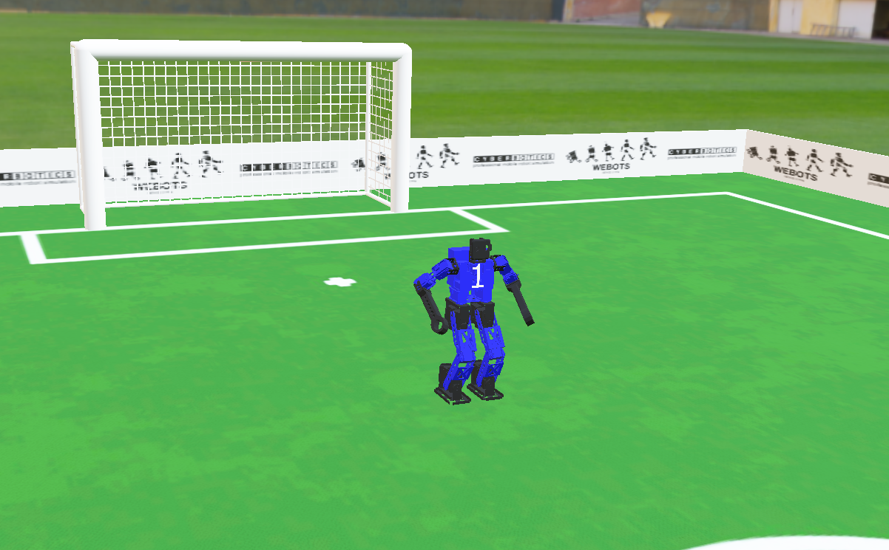

# RoboCup 2021

This repository contains all the Webots simulator files, along with the controller that is implemented in the "Melson" football team. There is also a docker that allows to test the team's operation on Webots platform.

 

## Docker
1. Install or update Webots according to https://github.com/RoboCup-Humanoid-TC/webots/blob/release/projects/samples/contests/robocup/README.md

2. Go to robocup/protos and clone https://gitlab.com/bbokserki/melman_robocup/-/tree/master/protos

3. Copy the KNR_Melson.json from https://gitlab.com/bbokserki/melman_robocup/-/tree/master/json to robocup/controllers/referee/team_1.json

4. Setup robocup/controllers/referee/game.json::              
```bash
     "host": "0.0.0.0",
     "red": {
       "hosts": [
         "127.0.0.1",
         "172.17.0.4",
         "172.17.0.5",
         "172.17.0.6",
         "172.17.0.7"
       ],
       "ports": [
         10021,
         10022,
         10023,
         10024
       ]
     },
```
5. Run the containers::

     `cd melman_robocup/`
     
     `docker build . -f docker/Dockerfile -t melman_robocup`
     
     `docker run -it --rm -eROBOCUP_SIMULATOR_ADDR=172.17.0.1:10021 melman_robocup`
     
     `docker run -it --rm -eROBOCUP_SIMULATOR_ADDR=172.17.0.1:10022 melman_robocup`
     
     `docker run -it --rm -eROBOCUP_SIMULATOR_ADDR=172.17.0.1:10023 melman_robocup`
     
     `docker run -it --rm -eROBOCUP_SIMULATOR_ADDR=172.17.0.1:10024 melman_robocup`
     

6. To use Dockerfile there is need to download /docker and /controllers paths from https://gitlab.com/bbokserki/melman_robocup/-/tree/master/


